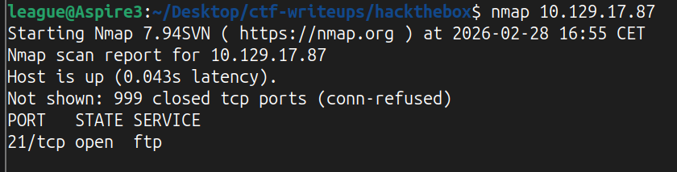
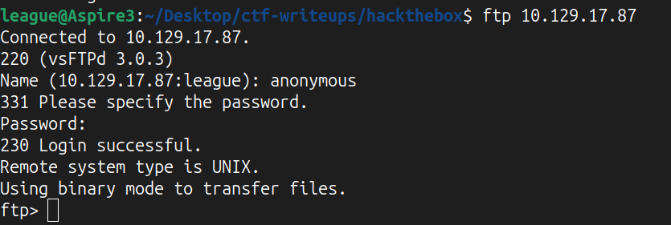
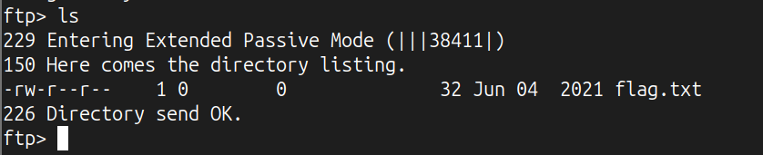
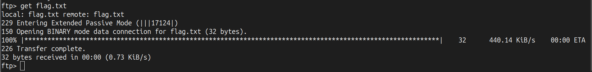
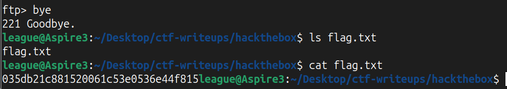

# Machine Overview

Link to the machine: https://app.hackthebox.com/machines/Fawn

This write-up covers the solution for the Fawn machine, one of the Tier 0 Foundations module machines.

It is considered a very easy machine and serves as an introduction to the FTP protocol and its exploitation.

# Enumeration 

Running nmap against the machine shows that port 21 is open, which appears to be running an FTP service.

# Exploitation

We can connect to the FTP server using `ftp machine_ip`.
Then we enter `anonymous` as the username and anything (or leave it blank) as the password.

 

Now we can use `ls` to show the content of the current directory, where we can see a file named `flag.txt`.

Since we are using an FTP connection, we cannot use basic Linux commands like `cat` to read the content of the file, but we need to use the FTP `get` command to download the file from the machine.

Now we can close the FTP connection using `bye`. The file `flag.txt` will now be in the local directory from which we initiated the FTP connection.

# Privilege Escalation
No privilege escalation was required.

# Lesson Learned 

- FTP (File Transfer Protocol) is used to transmit files on the network
- FTP uses a client-server architecture
- FTP usually works on port 21, but the actual data transmission occurs on port 20 (active mode) or on a dynamically assigned port (passive mode)
- FTP allows login with legitimate credentials (username and password), but may allow anonymous login (using just `anonymous` as username and accepting anything as the password)
- FTP transmits data in plain text, including the login phase. Secure alternatives such as FTPS or SFTP do exist
- Misconfigured FTP services with anonymous login enabled can expose sensitive files without authentication