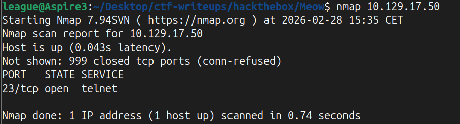
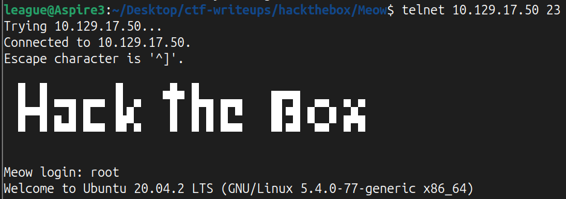
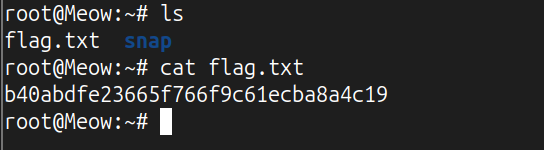

# Machine Overview 

Link to machine: https://app.hackthebox.com/machines/Meow 

This write-up covers the solution for the Meow machine, one of the Tier 0 Foundations module machines. 

It is considered a very easy machine and serves as a good introduction to how basic HTB machines work.

# Enumeration

Once connected to the VPN, we can start the enumeration running nmap against the machine.

Running `nmap machine_ip` shows that port 23 is open, which appears to be running a Telnet service.

# Exploitation 

We can connect to the machine using `telnet ip_machine 23`.

The server accepts the connection, and is going to prompt us for a username to login: the root account does not require a password in this case, so we can just type root to get root access. 

At this point, we are connected to the machine as root.
Running `whoami` confirms this by returning `root`.

We can now use `ls` to show the content of the current directory, then we'll see a file named `flag.txt`, then we can print its content with the command `cat flag.txt`, obtaining the root flag and completing the machine.

# Privilege Escalation
Not present.

# Lessons Learned 
The importance of proper authentication: a simple service enumeration led to root access.